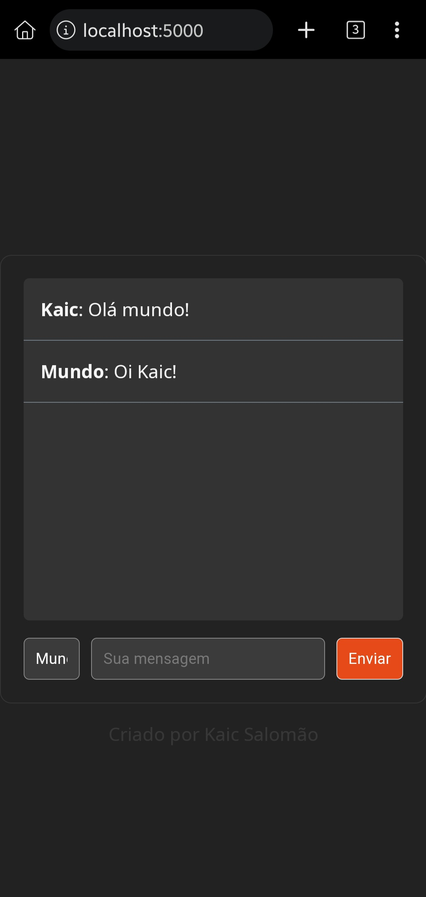

# Web Chat 
Um chat online escrito em python com o framework Flask junto com Flask-SocketIO




## Execute
Instale as dependências necessárias:

```pip install -r requirements.txt```

Execute o servidor:

```flask run```

Abra seu navegador acesse:
```https://127.0.0.1:5000```
